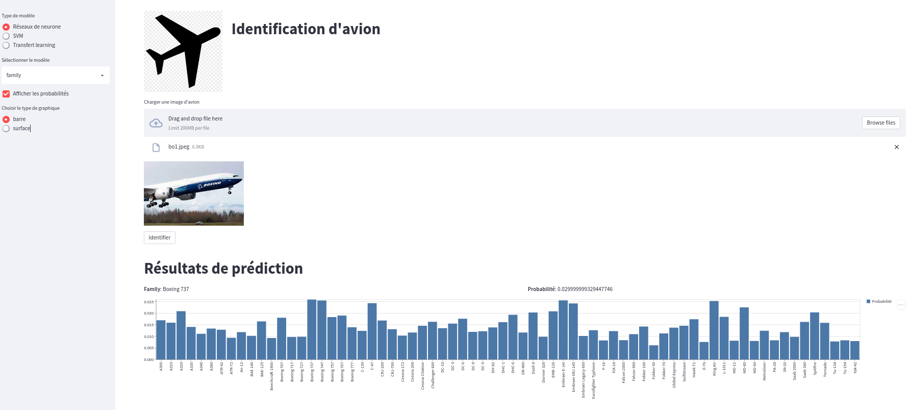
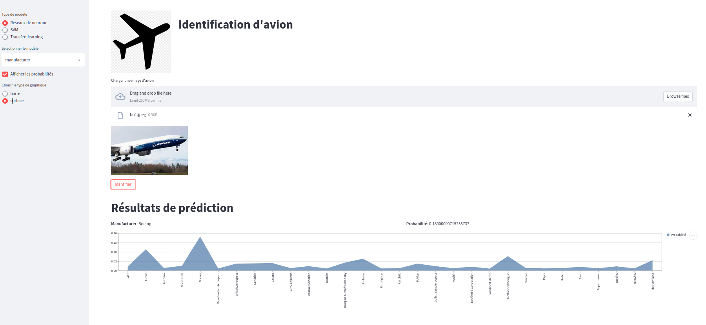

# Description
This project is meant to classify plane from pictures.
It use three models, Neural networks, SVM and transfert learning approche.

 


# Description of main files
Here are the contents of each notebook
- [notebooks/config.yaml](notebooks/config.yaml): configuration file to train and create the models
- [app/app.yaml](app/app.yaml): configuration file to run the streamlit application
- [data_download.ipynb](./notebooks/data_download.ipynb): download the database used, and place them in the appropriate code 
- [train_classification_model.ipynb](notebooks/train_classification_model.ipynb): draft 
- [cleaned_train_classification_model.ipynb](notebooks/cleaned_train_classification_model.ipynb): cleaned version of the draft
- [classification_neural_network_with_target](notebooks/classification_neural_network_with_target.ipynb): notebook of neural network with target
- [classification_svm_with_target](notebooks/classification_svm_with_target.ipynb): notebook for the model of SVM, with a polynomial kernel density
- [classification_transfert_learning_with_target](notebooks/classification_transfert_learning_with_target.ipynb): notebook of a transfert learning model 

*The last third notebooks should be running in the listing order. In fact there is a comparison between each notebook which use the saved model of the previous*

# Installation
- clone the project
- create new virtual env( not mandatory but recommanded)
- install all the requirement dependencies from the requirement file
    ```pip install -r requirements.txt```
# Run
After installation, it's important to setup the appropriate value in the configuration files before running

# Models 
## Saved model
Cause of a bandwith problem the saved models are not there currently but they are available [here](https://drive.google.com/drive/folders/1G7lrqa0cS42Rr722_QC-WErRDa6WL9R-?usp=sharing).

## Publication 
A first version is published here, and for the same reason it not yet take into account the models object. But you can clone the model and try it locally. 
The published version is available [here](https://share.streamlit.io/rich229/plane-classification/main/app/app.py)

# Exemples
Here are some examples
* With probabilities in bar

* With probabilities in surface


# References:
More information on the images [here ](https://www.robots.ox.ac.uk/~vgg/data/fgvc-aircraft/)
